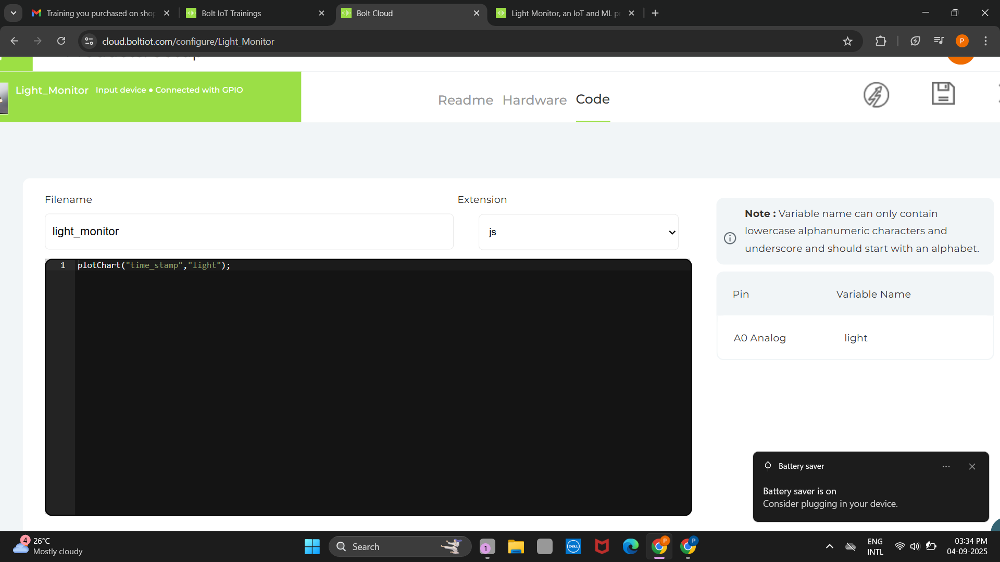

# 💡 Light Intensity Monitoring System

This project monitors **light intensity** using a **Bolt IoT device** and visualizes the collected data with **Google Charts**.  
Different types of graphs are implemented to better understand variations in light levels.  

---

## ⚙️ Hardware Setup

- Connected an **LDR sensor** with Bolt WiFi module to measure light intensity.  
- Sensor data is uploaded to **Bolt Cloud** for storage and processing.  

**Sensor Connection**  

**Bolt Cloud Linked with Sensor**  
  

**Hardware Setup**  

---

## 📜 Code for Data Collection

- The following code fetches sensor data from **Bolt Cloud**.  
- Data is stored for visualization using **Google Charts**.  

**Code**  
  

**Collected Data**  

---

## 📈 Graphical Visualizations  

We use **Google Chart Library** to visualize sensor data in different formats.  

---

### 🔹 Line Graph  

- Shows **trends over time** for light intensity.  
- Useful for observing **rising and falling patterns**.  

**Line Graph Code**  

**Line Graph Output**  

---

### 🔹 Bar Graph  

- Displays sensor values as **bars**.  
- Makes it easy to **compare values** at different times.  

**Bar Graph Code**  

**Bar Graph Output**  

---

### 🔹 Scatter Graph  

- Plots sensor data as **points** across time.  
- Helps identify **fluctuations** and **outliers**.  

**Scatter Graph Code**  

**Scatter Graph Output**  

---

### 🔹 Area Graph  

- Highlights the **cumulative data** by shading under the curve.  
- Shows overall **data distribution** clearly.  

**Area Graph Code**  

**Area Graph Output**  

---

### 🔹 Customized Area Graph  

- Improved visuals with **colors and custom styles**.  
- Makes charts more **engaging and user-friendly**.

-Explanation of Code

setChartLibrary('google-chart') → Use Google Charts library

setChartTitle('Light Intensity Monitoring System') → Title for the chart

setChartType('areaGraph') → Type of chart is Area Graph

setAxisName('Time','Light') → X-axis = Time, Y-axis = Light

setCrossHair(true) → Show crosshair guideline on hover

plotChart('time_stamp','light') → Plot data (time vs light)

**Customized Area Graph**  
 

### 🔹 Gauge Graph  

- The **Gauge Graph** works like a **speedometer**, showing real-time sensor value on a dial.  
- Useful for monitoring whether light intensity is **low, medium, or high** at a glance.  

**Gauge Graph Code**  

**Gauge Graph Output**  

## ✅ Final Outcome
- Successfully monitored **real-time light intensity** using a sensor.  
- Stored data securely in **Bolt Cloud**.  
- Visualized data with **multiple types of Google Charts**.  
- Compared graphs (line, bar, scatter, area, gauge) to analyze light intensity trends.  

---

## 📚 My Learnings
- Gained hands-on experience with **Bolt IoT Cloud** and its APIs.  
- Learned how to **collect, log, and retrieve sensor data** from the cloud.  
- Practiced using the **Google Chart library** to represent IoT data in different formats.  
- Understood how to **customize visualizations** (titles, axes, crosshairs, etc.).  
- Improved knowledge of **IoT systems**, **data visualization**, and **GitHub project documentation**.  

---

